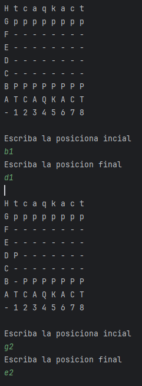

# Ajedrez
Es un ajedrez en java sin interfaz grafica, se maneja y se visualiza desde la consola.
Sigue las reglas del ajedrez meno el 3 enroque, problablemente tenga bugs y el codigo no es muy bueno.

Se moveria por coordenada tal que asi:

